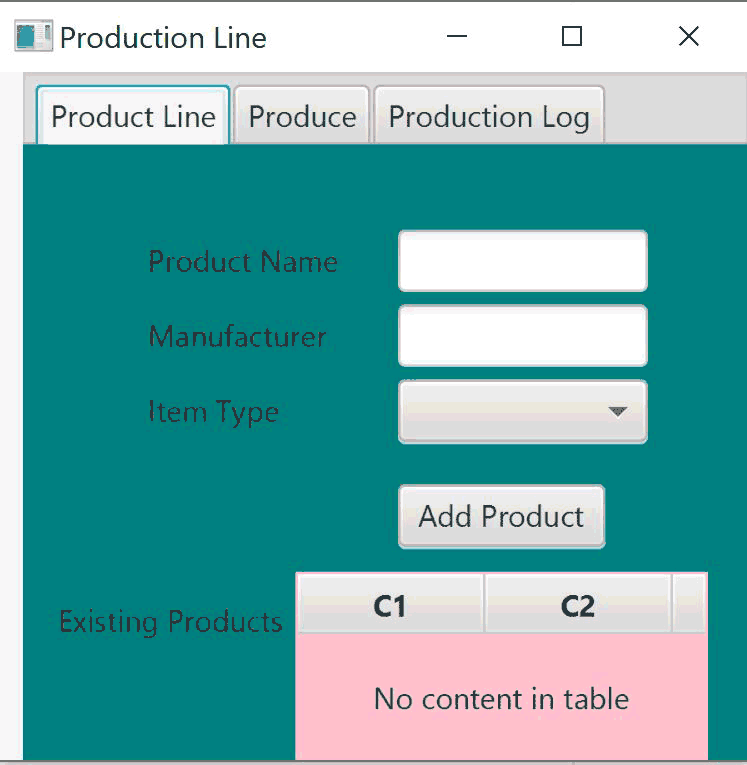
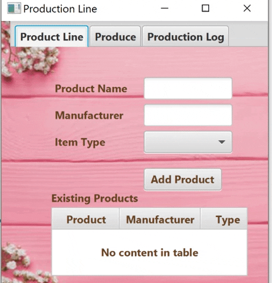

# ProductLineFXDbOOPNEW

Project Scenerio  
You have been hired to create software for a media player production facility that will keep track of what products are produced. Without the software, workers on the production floor are physically producing items and having to write down what is produced in a production log book. Management would like the production tracking to be more automated so the workers don't need to spend as much time recording what was produced, the log will be more accurate, and it will be easier to generate production reports.

In addition to the ability to record production, the software also needs the ability to add to the product line (the catalog of products that are able to be produced). I created this project with the guidance of Prof. Vanselow. I created this project on 9/30/2019. I had completed week 1 tto 3 previously, but had to delete it after having a Java/IntelliJ issue. I created this project as an assignment to help learn to make a GUI and Basic Database. This project was created by me as a Software Engineering student at Florida Gulf Coast University. This was created as a project for 
 

## Demonstration

## Documentation

Create a docs folder in your project. If using Java, generate JavaDoc in your IDE. If using C++, use Doxygen. Change repository settings (using Settings at top of page) to use GitHub Pages with your docs folder. Add a link to the javadoc/doxygen index.html file with this markdown: \[Text to appear]\(URL)  
The URL will be YourGitHubUserName.github.io/YourRepositoryName/foldername/filename  
Do not include the docs folder name in your URL.  
Sample: \[JavaDoc]\(https://pv-cop.github.io/PV-README-TEMPLATE/javadoc/index.html)    
[JavaDoc](https://pv-cop.github.io/PV-README-TEMPLATE/javadoc/index.html)

## Diagrams

</a>

## Built With

* IDE used is IntelliJ 
* Other software used - github, H2, Scene Builder

## Contributing
* My Prof. Vanselow assisted with the teaching of this project.

## Author

* Kathryn Campo

## License

Public repositories on GitHub are often used to share open source software. For your repository to truly be open source, you'll need to license it so that others are free to use, change, and distribute the software. https://help.github.com/articles/licensing-a-repository/  
You have the option to choose a license when you first create your repository.  
If you need to create a license for an existing repository...
1. Go to your repository.
2. Click on "Create new file" Button.
3. Type the file name as License.txt or License.md in the input box next to your repository name, a drop down button appears towards right side.
4. Choose the type of license of your choice.
5. Click "Commit new file" button at the bottom (Green button)
Credit https://stackoverflow.com/questions/31639059/how-to-add-license-to-an-existing-github-project  
To choose a license, see https://choosealicense.com/ 

## Acknowledgments

* Web sites utilized
Prof. Vanselows course website.
https://sites.google.com/site/profvanselow/course/cop-3003/oop-project?authuser=0
Tutorials Point
https://www.tutorialspoint.com/javafx/javafx_css.htm

* Classmates who helped

* Your professor or TA if they helped
Professor Vanselow

## History

9/30/2019 Sprint One completed.
10/3/2019 Updated CSS file on project to improve GUI.

## Key Programming Concepts Utilized

